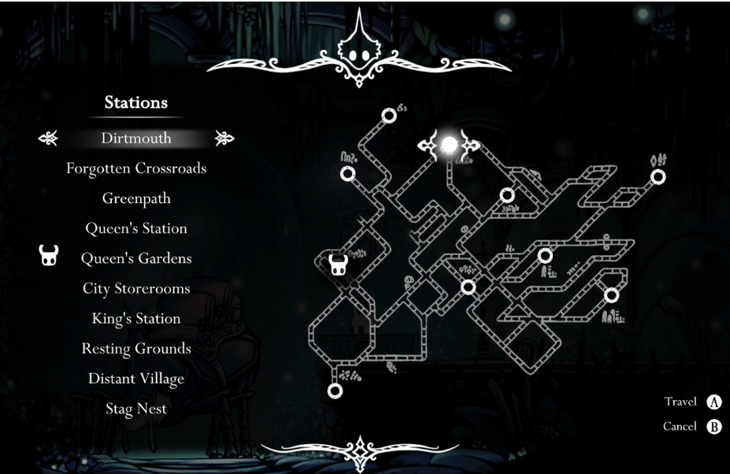

# Optimization Algorithms: Hollow Knight Route Optimization

## Project Overview
This project focuses on designing a Genetic Algorithm (GA) to optimize routes in the video game *Hollow Knight*, maximizing in-game currency (Geo) collection while minimizing risks of loss. The solution adheres to game-specific constraints and utilizes advanced genetic operators to ensure optimal performance and robust results.

## Objectives
The main goals of this project were:
1. Develop a GA to find the most optimal route in *Hollow Knight*, starting and ending at Dirtmouth.
2. Implement and compare at least three mutation operators and three crossover operators.
3. Perform a grid search to determine the best combination of parameters for the GA.
4. Provide a robust implementation that respects constraints and maximizes Geo earnings.

## Problem Statement
In *Hollow Knight*, traversing between areas yields varying Geo gains or losses. The goal was to help a player optimize their route for maximum earnings, respecting game constraints such as:
- Starting and ending at Dirtmouth.
- Visiting all game areas (with specific exceptions).
- Avoiding infeasible routes (e.g., Resting Grounds in the first half or skipping City Storerooms after Queen’s Gardens).

     
   *Figure: Map*

## Methodology
### Constraints
- Geo gains/losses between areas are provided in a matrix format.
- Routes must adhere to specified constraints, including the sequence of areas and specific exclusions.

### Genetic Algorithm Implementation
1. **Initialization**:
   - Randomly generated routes, respecting constraints.
   - Each individual (route) is represented as a list of area initials.

2. **Fitness Functions**:
   - **No Sharing**: Fitness based solely on Geo earnings.
   - **Sharing Mean**: Adjusts fitness by the mean Hamming distance between individuals to promote diversity.
   - **Sharing Sum**: Adjusts fitness by the sum of Hamming distances, reducing crowding near local optima.

3. **Selection Methods**:
   - Fitness Proportional (Roulette).
   - Rank Selection.
   - Tournament Selection.
   - Self-Adaptive Tournament Selection (final choice).

4. **Crossover Operators**:
   - **Partially Mapped Crossover (PMX)**: Preserves order and positional consistency between parents.
   - **Cycle Crossover (CX)**: Ensures every position inherits genes from exactly one parent.
   - **Order-Based Crossover (OBX)**: Transfers a subset of ordered elements from one parent to the child.
   - **Position-Based Crossover (PBX)**: Copies specific positions from one parent while filling gaps from the other.
   - **Order Crossover (OX)**: Preserves a subsequence from one parent while maintaining relative order from the other.

5. **Mutation Operators**:
   - **Swap**: Swaps two random positions in the individual.
   - **Displacement**: Moves a randomly selected section to a different position.
   - **Scramble**: Randomly shuffles elements within a subset.
   - **Invert**: Reverses the order of elements in a section.
   - **Thrors**: Shifts selected positions to adjacent positions in a circular manner.

6. **Final Parameters** (from grid search):
   - **Population size**: 800.
   - **Generations**: 500.
   - **Crossover probability**: 0.5.
   - **Elitism**: Enabled.
   - **Fitness function**: No sharing.

7. **Grid Search**:
   - Evaluated combinations of operators and parameters across 15 runs to ensure robustness.

### Deliverables
- **Code**: Well-documented Python code with a `main.py` file for easy execution.
- **Report**: Detailed explanation of the methodology, results, and analysis.
- **Presentation**: Summary of the project and its findings.

## Results
1. **Optimal Parameters**:
   - Cycle Crossover and Swap Mutation achieved the best results.
2. **Algorithm Performance**:
   - The GA consistently identified optimal routes across datasets.
   - Results demonstrated robustness, even with random Geo values.
3. **Key Insights**:
   - Fitness sharing was less effective for final outcomes despite aiding population diversity.
   - Self-Adaptive Tournament Selection provided a balance of exploration and exploitation.

## Conclusion
This project successfully optimized route planning in *Hollow Knight*, demonstrating the flexibility and power of Genetic Algorithms. The final solution balances constraints, diversity, and efficiency, providing players with a reliable route for maximizing in-game earnings.
